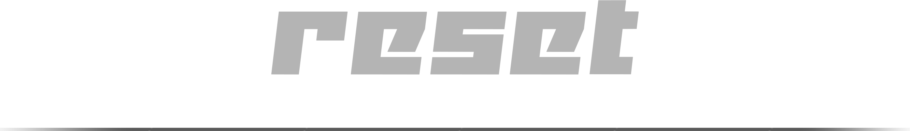

<!-- ╔══════════════════════════════ BEG ══════════════════════════════╗ -->

<br>
<div align="center">
    <p>
        
    </p>
</div>

<div align="center">
    
    <a href="https://github.com/mineui-org"></a>
    <br>
    
    
</div>
<br>

<!-- ╚═════════════════════════════════════════════════════════════════╝ -->


<!-- ╔══════════════════════════════ DOC ══════════════════════════════╗ -->

- ## Overview 👀

    - #### Why ?
        > Modern CSS reset that removes browser inconsistencies and provides sensible defaults. Includes accessibility features, print styles, reduced motion support, RTL handling, and focus states. Works standalone or with @mineui/semantic.

    - #### When ?
        > Use at the start of every project as your CSS foundation. Provides a clean slate for building UI components with better defaults than browser stylesheets.

    <br>
    <br>

- ## Quick Start 🔥

    > install [`hmm`](https://github.com/minejs-org/hmm) first.

    ```bash
    # in your terminal
    hmm i @mineui/reset
    ```

    ```scss
    # in your `.scss` files (import first!)
    @use "./node_modules/@mineui/reset/dist/scss/index.scss";
    ```

    <div align="center">  </div>
    <br>


    - ### Standalone Usage

        ```html
        <!DOCTYPE html>
        <html lang="en">
        <head>
          <link rel="stylesheet" href="mineui-reset.css">
        </head>
        <body>
          <!-- Clean, consistent base styles -->
        </body>
        </html>
        ```

    - ### With @mineui/semantic

        ```scss
        @use '@mineui/reset';
        @use '@mineui/semantic';
        
        // Your styles here
        ```

    <br>
    <br>

- ## Documentation 📑


    - ### Features ⚡

        - #### Box Sizing Reset
            > All elements use `box-sizing: border-box` for predictable layouts.

        - #### Remove Default Margins & Paddings
            > All margins and paddings reset to 0 for consistent spacing.

        - #### Better Typography
            > Smooth fonts, optimized line heights, and word breaking.

        - #### Modern Form Resets
            > Remove spinners, search decorations, and normalize inputs.

        - #### Focus States
            > Visible focus rings for keyboard navigation with `:focus-visible`.

        - #### RTL Support
            > Automatic text direction handling for RTL languages.

        - #### Print Styles
            > Optimized styles for printing documents.

        - #### Reduced Motion
            > Respects `prefers-reduced-motion` for accessibility.

        - #### High Contrast Mode
            > Enhanced focus for high contrast settings.

        - #### Custom Scrollbar
            > Styled scrollbars that respect theme colors.

        - #### Accessibility Helpers
            > Screen reader classes, skip links, and ARIA support.

        - #### Code Blocks
            > Pre-styled code and pre elements.

        - #### Selection
            > Branded text selection color.

        <div align="center">  </div>
        <br>

    - ### CSS Variables Integration 🎨

        > Works seamlessly with @mineui/semantic variables.

        ```css
        /* These variables are used if available */
        --font-base          /* Body font family */
        --font-mono          /* Code font family */
        --font-size-base     /* Base font size */
        --line-height-base   /* Base line height */
        --text-1             /* Primary text color */
        --text-inverse       /* Inverse text color */
        --bg-page            /* Page background */
        --bg-surface         /* Surface background */
        --bg-code            /* Code block background */
        --bg-overlay         /* Modal/dialog backdrop */
        --border-1           /* Border color */
        --border-focus       /* Focus ring color */
        --brand              /* Selection background */
        --input-placeholder  /* Placeholder color */
        --disabled-opacity   /* Disabled element opacity */
        ```

    - ### Accessibility Classes 🦮

        - #### Screen Reader Only

            ```html
            <span class="sr-only">
              For screen readers only
            </span>
            ```

        - #### Skip to Main Content

            ```html
            <a href="#main" class="skip-to-main">
              Skip to main content
            </a>
            
            <main id="main">
              <!-- Content -->
            </main>
            ```

    - ### Print Optimization 🖨️

        > Automatically optimized for printing:
        - Removes shadows, backgrounds, colors
        - Shows link URLs after links
        - Prevents page breaks inside important elements
        - Displays table headers on each page

    - ### Focus Management 🎯

        > Smart focus handling:
        ```css
        /* No outline on mouse click */
        :focus { outline: none; }
        
        /* Visible outline on keyboard navigation */
        :focus-visible {
          outline: 2px solid var(--border-focus);
          outline-offset: 2px;
        }
        ```

    - ### Form Enhancements 📝

        > Better form defaults:
        - Removed number input spinners
        - Removed search input decorations
        - Inherit fonts and colors
        - Disabled cursor and opacity
        - Vertical textarea resize only
        - File input cursor pointer

    - ### Related 🔗

        - ##### [@mineui/semantic](https://github.com/mineui-org/semantic)
            > Theme system that integrates with this reset

        - ##### [@mineui/tokens](https://github.com/mineui-org/tokens)
            > Design tokens used by semantic variables

<!-- ╚═════════════════════════════════════════════════════════════════╝ -->


<!-- ╔══════════════════════════════ END ══════════════════════════════╗ -->

<br>
<br>

---

<div align="center">
    <a href="https://github.com/maysara-elshewehy"></a>
</div>

<!-- ╚═════════════════════════════════════════════════════════════════╝ -->